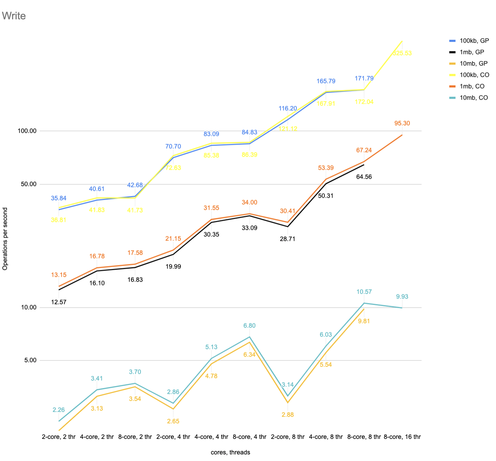
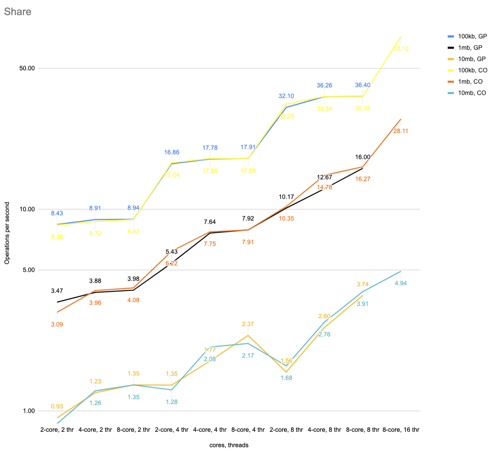
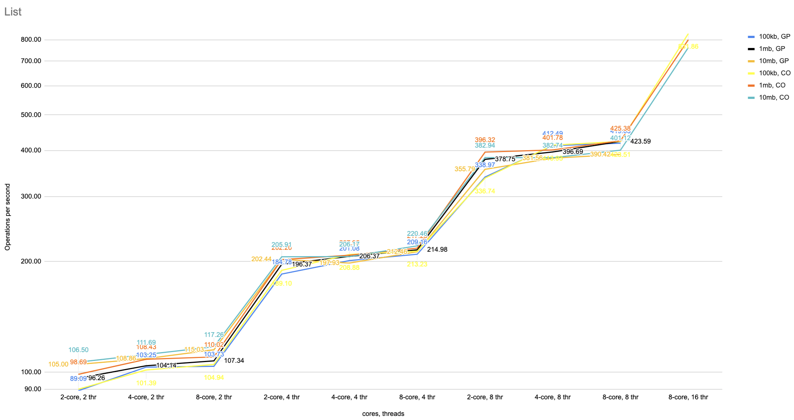
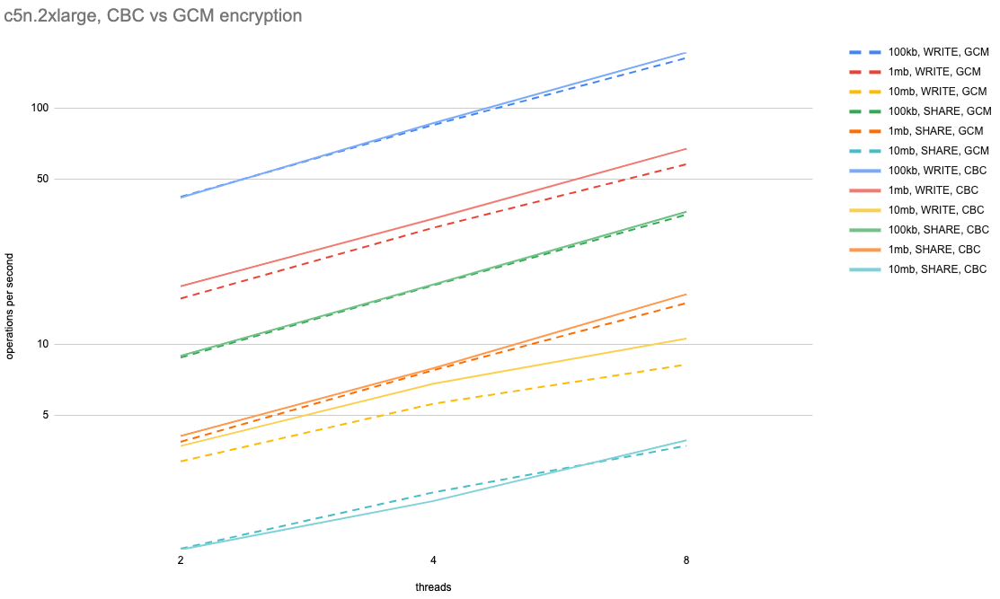

# Datasafe long run test results

Tests have been run on 6 different aws ec2 instances:

-   m5.large (2 CPU, 8GB RAM);
-   m5.xlarge (4 CPU, 16GB RAM);
-   m5.2xlarge (8 CPU, 32GB RAM);
-   c5n.large (2 CPU, 5.25GB RAM);
-   c5n.xlarge (4 CPU, 10.5GB RAM);
-   c5n.2xlarge (8 CPU, 21GB RAM).

GP on charts stands for General Purpose (m5) instances
CO - Compute Optimized (c5n).

On each instance test has been run 3 days, 3 times per day with 2, 4 and 8 threads and 100kb, 1mb, 10mb file size.
JVM was launched with -Xmx256m

For testing multi-bucket performance 6 aws s3 buckets were created.
Multi-bucket performance was tested only on c5n.2xlarge instance with using 2, 4, 6 buckets.

1.  WRITE operation

2.  READ operation

3.  SHARE operation

4.  LIST operation

5.  DELETE Operation

Single bucket ALL-IN-ONE Chart

MULTIBUCKET TEST

All tests were made using AES256_CBC Encryption algorithm. On next chart test results using AES256_GCM comparing to AES256_CBC.

CEPH Test

Ceph testing cluster consists of osd1, osd2, osd3 t2.xlarge ec2 instances and t2.large instances for ceph monitor and gateway.

9 volumes with size 100gb and type io2 with 4000 IOPS were used as storage.

Each test was run with 2, 4, 8, 16 threads with single bucket and multi bucket(3 buckets were used) from ec2 c5n.2xlarge(8core) instance. 

