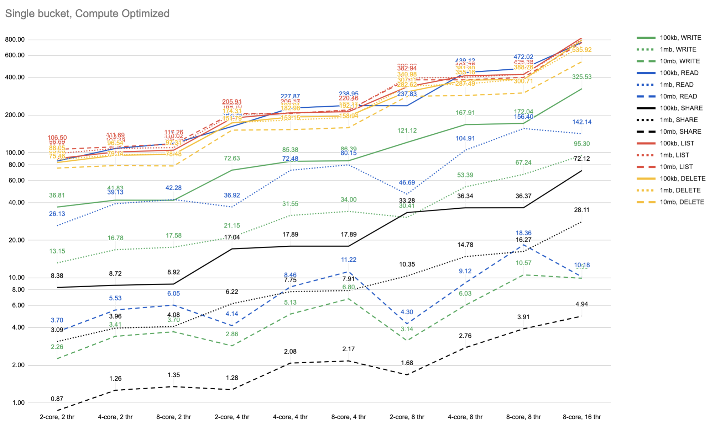
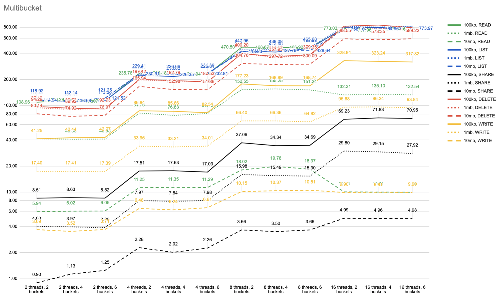
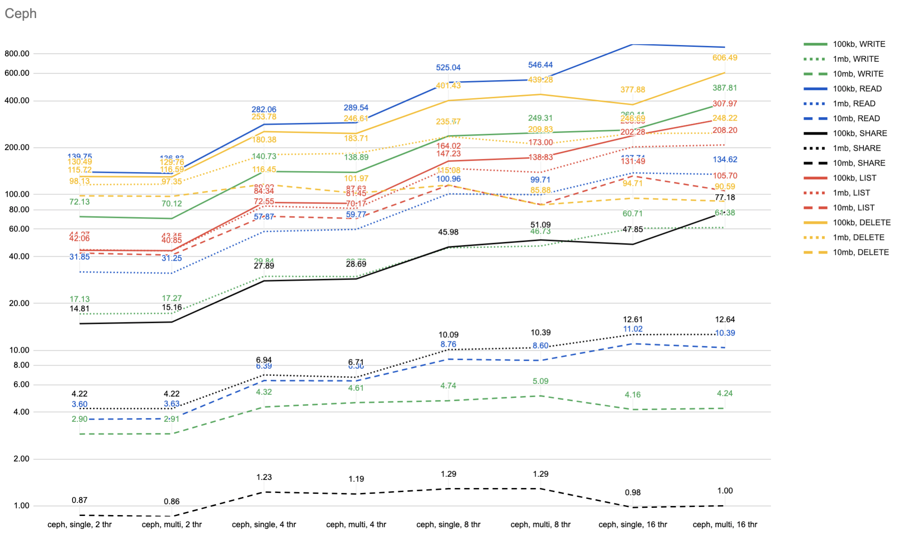

# Datasafe long run test results

### 1. Testing environment preparation
Datasafe throughput tests was run on different Amazon EC2 instances. On each instance after creation was installed JDK, maven and git. Then datasafe project was pulled and executed 
[RandomActionsOnDatasafeIT](datasafe-business-tests-random-actions/src/test/java/de/adorsys/datasafe/business/impl/e2e/randomactions/RandomActionsOnDatasafeIT.java) which uses one bucket. Test was launched with all combinations of 2, 4, 8 and 16 parallel threads and 100kb, 1mb and 10mb file sizes.

#### Preparation commands for running test

```text
ssh -i ~/Documents/mhr.pem ec2-user@x.x.x.x
```

where x.x.x.x - current ip address of ec2 instance.

mhr.pem - key pair file to access remote console by ssh.

Uploading jdk to remote server. jdk-8u221-linux-x64.rpm file should be first downloaded from Oracle website.
```text
scp -i ~/Documents/mhr.pem ~/jdk-8u221-linux-x64.rpm ec2-user@3.120.206.136:/home/ec2-user
```
Installation of jdk, maven, git.
```text
sudo yum install -y jdk-8u221-linux-x64.rpm
sudo yum install -y git
sudo yum install -y maven
```

Datasafe checkout and compilation

```text
git clone https://github.com/adorsys/datasafe.git
mvn -DskipTests=true install
cd datasafe-long-run-tests/datasafe-business-tests-random-actions/
```

Test execution command.

```text
mvn -DAWS_ACCESS_KEY="***" \
    -DAWS_SECRET_KEY="***" \
    -DAWS_BUCKET="***" \
    -DAWS_REGION="eu-central-1" \
    -DtestArgs="-Xmx512m \
    -Dcom.sun.management.jmxremote.ssl=false \
    -Dcom.sun.management.jmxremote.authenticate=false \
    -Dcom.sun.management.jmxremote.port=8090 \
    -Dcom.sun.management.jmxremote.rmi.port=8090 \
    -Djava.rmi.server.hostname=127.0.0.1 \
    -Dcom.sun.management.jmxremote.local.only=false" \
    -Dtest=RandomActionsOnDatasafeTest test
```

*** should be changed to real aws s3 bucket name, access key and secret key.

With Xmx parameter used memory could be configured. But due to some memory leaks it was not used and test ran with all available memory.

Enabling jmx monitoring
```text
ssh -i ~/Documents/mhr.pem -L 8090:127.0.0.1:8090 ec2-user@x.x.x.x
```

### 2. Testing procedure description

Tests were done on 6 different aws ec2 instances:

-   m5.large (2 CPU, 8GB RAM);
-   m5.xlarge (4 CPU, 16GB RAM);
-   m5.2xlarge (8 CPU, 32GB RAM);
-   c5n.large (2 CPU, 5.25GB RAM);
-   c5n.xlarge (4 CPU, 10.5GB RAM);
-   c5n.2xlarge (8 CPU, 21GB RAM).

On chart, **GP** stands for General Purpose (m5) instances and  **CO** - for Compute Optimized (c5n).

For statistics and repetition, test was executed in following manner:
1. Test suite consisted of same operation sequence that was executed by 2, 4 and 8 threads 
and had 100kb, 1mb, 10mb file size as payload.
1. Test suite was executed 3 times per day on fixed time (Day suite)
1. Day suite was repeated for 3 days, so each test was done 3 times per day for 3 days
1. JVM was launched with `-Xmx256m`

For testing multi-bucket performance 6 aws s3 buckets were created.
Multi-bucket performance was tested only on c5n.2xlarge instance with using 2, 4, 6 buckets.

Single bucket can be found in [RandomActionsOnDatasafeTest](datasafe-business-tests-random-actions/src/test/java/de/adorsys/datasafe/business/impl/e2e/randomactions/RandomActionsOnDatasafeTest.java) class.
Multibucket test is in [RandomActionsOnMultiBucketTest](datasafe-business-tests-random-actions/src/test/java/de/adorsys/datasafe/business/impl/e2e/randomactions/RandomActionsOnMultiBucketTest.java) class

Example of raw test results:
```text
07:57:55.523 [main] INFO de.adorsys.datasafe.business.impl.e2e.randomactions.RandomActionsOnDatasafeIT - ==== Statistics for AMAZON with 2 threads and 100 Kb filesize: ====
07:57:55.532 [main] INFO de.adorsys.datasafe.business.impl.e2e.randomactions.RandomActionsOnDatasafeIT - WRITE : StatisticService.Percentiles(stat={50=35.0, 99=113.73, 90=79.0, 75=57.0, 95=87.65}, throughputPerThread=21.199480270806266)
07:57:55.532 [main] INFO de.adorsys.datasafe.business.impl.e2e.randomactions.RandomActionsOnDatasafeIT - SHARE : StatisticService.Percentiles(stat={50=210.0, 99=537.75, 90=354.5, 75=299.5, 95=440.25}, throughputPerThread=4.598540145985401)
07:57:55.532 [main] INFO de.adorsys.datasafe.business.impl.e2e.randomactions.RandomActionsOnDatasafeIT - LIST : StatisticService.Percentiles(stat={50=18.0, 99=45.39, 90=25.0, 75=21.0, 95=29.95}, throughputPerThread=53.27014218009479)
07:57:55.532 [main] INFO de.adorsys.datasafe.business.impl.e2e.randomactions.RandomActionsOnDatasafeIT - DELETE : StatisticService.Percentiles(stat={50=17.0, 99=47.73, 90=26.0, 75=19.0, 95=35.65}, throughputPerThread=51.12889738382511)
07:57:55.532 [main] INFO de.adorsys.datasafe.business.impl.e2e.randomactions.RandomActionsOnDatasafeIT - CREATE_USER : StatisticService.Percentiles(stat={50=397.0, 99=1020.61, 90=639.1, 75=552.0, 95=851.05}, throughputPerThread=2.0807324178110695)
07:57:55.533 [main] INFO de.adorsys.datasafe.business.impl.e2e.randomactions.RandomActionsOnDatasafeIT - READ : StatisticService.Percentiles(stat={50=16.0, 99=51.09, 90=18.0, 75=17.0, 95=21.0}, throughputPerThread=59.33647388994688)

07:59:13.117 [main] INFO de.adorsys.datasafe.business.impl.e2e.randomactions.RandomActionsOnDatasafeIT - ==== Statistics for AMAZON with 2 threads and 1024 Kb filesize: ====
07:59:13.117 [main] INFO de.adorsys.datasafe.business.impl.e2e.randomactions.RandomActionsOnDatasafeIT - WRITE : StatisticService.Percentiles(stat={50=106.0, 99=168.82, 90=132.0, 75=116.0, 95=146.0}, throughputPerThread=9.077864651966383)
07:59:13.117 [main] INFO de.adorsys.datasafe.business.impl.e2e.randomactions.RandomActionsOnDatasafeIT - SHARE : StatisticService.Percentiles(stat={50=470.5, 99=855.25, 90=747.5, 75=670.25, 95=783.25}, throughputPerThread=2.120855074903215)
07:59:13.117 [main] INFO de.adorsys.datasafe.business.impl.e2e.randomactions.RandomActionsOnDatasafeIT - LIST : StatisticService.Percentiles(stat={50=16.0, 99=53.39, 90=23.0, 75=19.0, 95=25.0}, throughputPerThread=55.22256067603419)
07:59:13.118 [main] INFO de.adorsys.datasafe.business.impl.e2e.randomactions.RandomActionsOnDatasafeIT - DELETE : StatisticService.Percentiles(stat={50=17.0, 99=61.46, 90=30.0, 75=20.0, 95=45.0}, throughputPerThread=49.51411383618695)
07:59:13.118 [main] INFO de.adorsys.datasafe.business.impl.e2e.randomactions.RandomActionsOnDatasafeIT - CREATE_USER : StatisticService.Percentiles(stat={50=359.0, 99=552.8199999999999, 90=470.2, 75=421.75, 95=516.1}, throughputPerThread=2.632271650434325)
07:59:13.118 [main] INFO de.adorsys.datasafe.business.impl.e2e.randomactions.RandomActionsOnDatasafeIT - READ : StatisticService.Percentiles(stat={50=45.0, 99=79.09, 90=50.0, 75=47.0, 95=57.0}, throughputPerThread=21.367984118390183)

08:04:13.146 [main] INFO de.adorsys.datasafe.business.impl.e2e.randomactions.RandomActionsOnDatasafeIT - ==== Statistics for AMAZON with 2 threads and 10240 Kb filesize: ====
08:04:13.147 [main] INFO de.adorsys.datasafe.business.impl.e2e.randomactions.RandomActionsOnDatasafeIT - WRITE : StatisticService.Percentiles(stat={50=511.0, 99=1052.67, 90=617.0, 75=540.75, 95=682.0}, throughputPerThread=1.7302486534758463)
08:04:13.147 [main] INFO de.adorsys.datasafe.business.impl.e2e.randomactions.RandomActionsOnDatasafeIT - SHARE : StatisticService.Percentiles(stat={50=1503.5, 99=2321.5, 90=2135.5, 75=1822.0, 95=2188.5}, throughputPerThread=0.7149220110869652)
08:04:13.147 [main] INFO de.adorsys.datasafe.business.impl.e2e.randomactions.RandomActionsOnDatasafeIT - LIST : StatisticService.Percentiles(stat={50=15.0, 99=51.39, 90=23.0, 75=18.0, 95=30.9}, throughputPerThread=57.84273363524084)
08:04:13.147 [main] INFO de.adorsys.datasafe.business.impl.e2e.randomactions.RandomActionsOnDatasafeIT - DELETE : StatisticService.Percentiles(stat={50=21.0, 99=64.0, 90=36.3, 75=23.0, 95=48.65}, throughputPerThread=39.00483003736444)
08:04:13.147 [main] INFO de.adorsys.datasafe.business.impl.e2e.randomactions.RandomActionsOnDatasafeIT - CREATE_USER : StatisticService.Percentiles(stat={50=414.0, 99=584.28, 90=496.8, 75=469.75, 95=545.4}, throughputPerThread=2.3832221163012393)
08:04:13.147 [main] INFO de.adorsys.datasafe.business.impl.e2e.randomactions.RandomActionsOnDatasafeIT - READ : StatisticService.Percentiles(stat={50=319.0, 99=458.53, 90=362.0, 75=334.0, 95=390.45}, throughputPerThread=3.051153201906971)
```

Then results was parsed and transformed with help of [parse_script.groovy](datasafe-business-tests-random-actions/parse_script.groovy) to suitable for charts builder view.

```text
WRITE
Threads	100kb	1mb	10mb
2	42.39896054161253	18.155729303932766	3.4604973069516927
SHARE
Threads	100kb	1mb	10mb
2	9.197080291970803	4.24171014980643	1.4298440221739304
LIST
Threads	100kb	1mb	10mb
2	106.54028436018957	110.44512135206838	115.68546727048168
DELETE
Threads	100kb	1mb	10mb
2	102.25779476765022	99.0282276723739	78.00966007472888
READ
Threads	100kb	1mb	10mb
2	118.67294777989376	42.735968236780366	6.102306403813942  
```

### 3.  Test result charts

1.  WRITE operation


2.  READ operation


3.  SHARE operation


4.  LIST operation


5.  DELETE Operation


Single bucket ALL-IN-ONE Chart




MULTIBUCKET TEST



All tests were made using AES256_CBC Encryption algorithm. On next chart test results using AES256_GCM comparing to AES256_CBC.


### 4. CEPH S3 storage test

For Ceph testing, cluster consists of osd1, osd2, osd3 t2.xlarge ec2 instances and t2.large instances for ceph monitor and gateway.

9 volumes with size 100gb and type io2 with 4000 IOPS were used as storage.

Each test was run with 2, 4, 8, 16 threads with single bucket and multi bucket(3 buckets were used) from ec2 c5n.2xlarge(8core) instance. 



### 5. Simple Datasafe Adapter test
There is also [RandomActionsOnSimpleDatasafeAdapterTest](datasafe-business-tests-random-actions/src/test/java/de/adorsys/datasafe/business/impl/e2e/randomactions/RandomActionsOnSimpleDatasafeAdapterTest.java) for testing functionality of Simple Datasafe Adapter (used for compatibility with predecessor of datasafe - docusafe). 
To run test you need to have installed jdk and maven. 
If your storage is aws s3 then command will be:
```text
mvn -DAWS_ACCESS_KEY="accesskey" \
    -DAWS_SECRET_KEY="secretkey" \
    -DAWS_BUCKET="datasafe-bucket" \
    -DAWS_REGION="eu-central-1" \
    -DtestArgs="-Xmx256m \                  # memory limit for test
    -DSTORAGE_PROVIDERS="AMAZON" \          # means that external s3 compatible storage will be used. By default local MINIO container is used.
    -DFIXTURE_SIZE="MEDIUM" \               # available values: MEDIUM (1000 operations), LARGE (10000 operations). By default small fixture is used with 200 operations.
    -DTHREADS=16 \                          # comma separated list of desired number of threads
    -DFILE_SIZES=100,1024,10240" \          # comma separated list of file sizes used in test
    -Dtest=RandomActionsOnSimpleDatasafeAdapterTest test
```
For Ceph you have to add AWS_URL param. Without this parameter test by default trying to connect to Amazon.
```text
mvn -DAWS_ACCESS_KEY="accesskey" \
    -DAWS_SECRET_KEY="secretkey" \
    -DAWS_BUCKET="ceph-bucket" \
    -DAWS_URL="host.ceph.com:7480" \
    -DtestArgs="-Xmx256m -DSTORAGE_PROVIDERS="AMAZON" -DFIXTURE_SIZE="MEDIUM" -DTHREADS=2,4,8,16 -DFILE_SIZES=100,1024,10240" \
    -Dtest=RandomActionsOnSimpleDatasafeAdapterTest test
```
Test will automatcally run in all combinations of values of threads, file_size and storage providers lists.

For simplifying running this test there is [runSimpleDatasafeAdapterPerformanceTest.sh](../scripts/runSimpleDatasafeAdapterPerformanceTest.sh) 
script which uses credentials from environment variables and by default runs test with small fixture size, 2 threads and 100kb file size.
AWS_ACCESS_KEY, AWS_SECRET_KEY, AWS_BUCKET, AWS_REGION environment variables have to be set. And for Ceph also AWS_URL has to be set. 